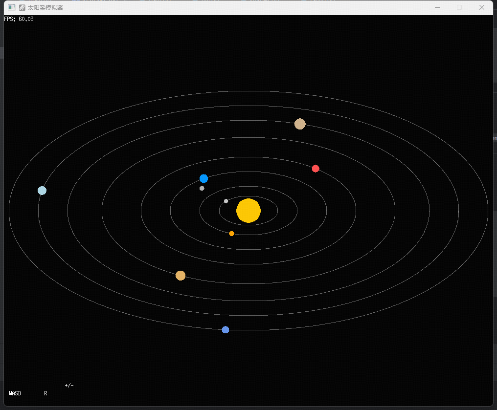

# 🌌 SolarView-Go · 太阳系模拟器

基于 [Ebiten](https://ebiten.org) 开发的高性能二维太阳系模拟器，使用 Go 语言构建，可视化展示太阳系行星运动轨道，支持仿 3D 视角交互切换。



## ✨ 特性亮点

- 🌍 八大行星动态轨道旋转
- 🌕 月亮围绕地球同步公转
- 🌀 椭圆轨道视觉效果（伪3D视角）
- 🎮 键盘交互切换视角、缩放、平移
- 🚀 高性能渲染，无卡顿
- 🔄 一键重置视角
- 📊 实时 FPS 显示

## 🎮 操作说明

| 按键       | 功能说明         |
|------------|------------------|
| ↑ / ↓      | 改变视角仰角（椭圆压缩） |
| ← / →      | 旋转观察角度     |
| `+` / `-`  | 缩放整体太阳系   |
| W / A / S / D | 平移观察画面  |
| R          | 重置为默认视角   |

---

## 🛠️ 开发与运行

### 克隆代码

```bash
git clone https://github.com/yourname/solarview-go.git
cd solarview-go
```

### 安装依赖

```bash
go get github.com/hajimehoshi/ebiten/v2
```

### 运行

```bash
go run main.go
```

### 构建可执行程序

```bash
go build -o solarview
```

---

## 📁 项目结构

```
solarview-go/
├── main.go           # 主程序
├── go.mod            # Go 模块定义
├── README.md         # 项目说明文档
└── screenshot.png    # 项目预览图（可选）
```

---

## 📷 效果截图


---

## 📄 License

MIT © [gallifreyCar](https://github.com/gallifreyCar)
```